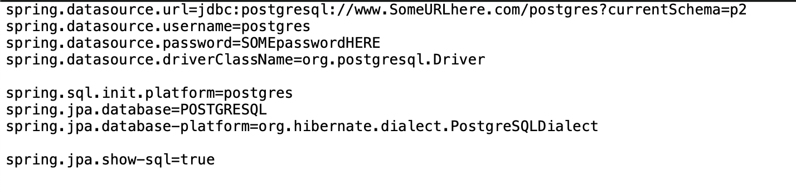

# Project 2 StockYourself Backend -- Team Amplifier

The goal of this project is to use the Agile project management philosophy, Scrum methodology.  By working in a small team we were able to practice git workflows utilizing the following frameworks: PostgreSQL, Spring Boot, Angular, Spring testing, and Selenium.

--------

StockYourself is a web application that allows users to make a portfolio with up to 5 stocks, tracking weekly activity, make posts on portfolios and post on other posts. 


## Technologies Used

* AWS RDS PostgreSQL 12
* Spring Boot on Java 8
* JUnit 5
* Spring Testing
* Cucumber 7
* Selenium 4
* Angular

## Features

List of features ready and TODOs for future development

* user can log in 
* user can log out
* user can view a post


To-do list:

* user has a portfolio and upon logging in can view it
* system will add stock ticker of stocks to users portfolio
* user can update portfolio
* user can view another users portfolio
* users portfolio has a current ticker for the day
* user can create a post
* user can update a post made by self
* user can delete a post made by self
* user can comment on a post by another user
* new user can register
* admin can delete posts
* admin can disable users


## Getting Started

1. Go to your Documents folder
2. Make two new folders
3. Rename your new folders "StockYourself Frontend" and "StockYourself Backend"

**If You Have a Windows Computer**

4. Open a new Command Prompt in your StockYourself Backend folder like this. <br><br> 

**If You Have a Mac**

4. Open a new terminal in your StockYourself Backend folder like this. <br><br> 

**Joint Instructions**

5. Go to this project's GitHub [page](https://github.com/211115-jwa/P2-StockYourself-backend-Amplifier) and clicking on the green code button. <br><br> 
6. Most of you want HTTPS
7. Click the double boxes to copy this command. <br><br> 

**If You Have a Windows Computer**

8. Go back to your command prompt that you opened in step 4.

**If You Have a Mac**

8. Go back to your terminal that you opened in step 4.

**Joint Instructions**

9. Type
```
git clone [paste url here]
```
- Now we check if you have Java and if you do, which version.
10. In your command prompt/terminal type:
```
javac -version
```
11. It should look something like this. <br><br> 
12. If there is no return value or the version number is below 8 go [here](https://www3.ntu.edu.sg/home/ehchua/programming/howto/JDK_Howto.html). Follow the instructions for your operating system.
13. Next you will install PostgreSQL from [here](https://www.postgresqltutorial.com/install-postgresql/).  Follow the instructions for your operating system.
14. Install Eclipse from [here](https://www.eclipse.org/downloads/packages/installer)
15. Install DBeaver from [here](https://dbeaver.io/download/)
- In step 9. you cloned the repository into your new folder TRMS.  Now that you have Java, Postgres, Eclipse, and VS Code installed on your system, you are going to populate your new SQL database and run the program.
16. Open Eclipse IDE for Enterprise Developers
17. Go to File -> Import -> Maven -> Existing Maven Projects
18. Browse for trms-back
19. Finish
- The SQL scripts are in database
20. Open DBeaver
21. Go to File -> New
22. Select DBeaver -> Database Connection
23. Select the PostgreSQL Blue Elephant
24. Leave everything as it is
25. Check the connection, if not connecting, troubleshoot.
26. Finish
27. Make a application.properties in src/main/resources that looks similar to this: <br><br>  
28. Make a Schema called P2
29. Right click on P2, go to SQL Editor -> Open SQL Console
30. Copy the Script in DDL.sql into the SQL Console and run it.
31. Repeat step 29. then Copy the DML.sql into the new console and run it.
32. Expand src/main/java -> com.revature.stockYourself -> StockYourselfApplication.java
33. Right click on StockYourselfApplication.java
34. Select Run as -> Spring Boot Application 
35. Please find the rest of the instructions in ReadMe [here](https://github.com/211115-jwa/P2-StockYourself-Frontend-Amplifier)


## License

Copyright (c) 2022 Team Amplifire

Team Amplifire:  <br>
          Brett Dixon <br>
          Daniel Joseph <br>
          Kimberly Kohel-Hayes <br>
          Andrew Wisdom <br>

Permission is hereby granted, free of charge, to any person obtaining a copy of this software and associated documentation files (the "Software"), to deal in the Software without restriction, including without limitation the rights to use, copy, modify, merge, publish, distribute, sublicense, and/or sell copies of the Software, and to permit persons to whom the Software is furnished to do so, subject to the following conditions:

The above copyright notice and this permission notice shall be included in all copies or substantial portions of the Software.


THE SOFTWARE IS PROVIDED "AS IS", WITHOUT WARRANTY OF ANY KIND, EXPRESS OR IMPLIED, INCLUDING BUT NOT LIMITED TO THE WARRANTIES OF MERCHANTABILITY, FITNESS FOR A PARTICULAR PURPOSE AND NONINFRINGEMENT. IN NO EVENT SHALL THE AUTHORS OR COPYRIGHT HOLDERS BE LIABLE FOR ANY CLAIM, DAMAGES OR OTHER LIABILITY, WHETHER IN AN ACTION OF CONTRACT, TORT OR OTHERWISE, ARISING FROM, OUT OF OR IN CONNECTION WITH THE SOFTWARE OR THE USE OR OTHER DEALINGS IN THE SOFTWARE.


